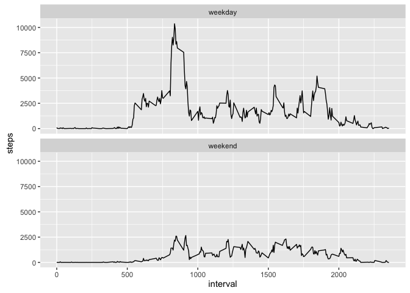

# Reproducible Research: Peer Assessment 1


## Loading and preprocessing the data


```r
inputzip <- "activity.zip"
unzip(inputzip)
inputfile <- "activity.csv"
activitydt <- read.csv(inputfile, header = TRUE)
```

As read from the csv, it has three colums for steps, date, and interval.  The date and interval columns are really together a date and time, that we suspect we'll want.  We create a new column datetime to hold a full date-time string, and we retain the intermediate steps, giving us choices during our analysis.


```r
activitydt <- mutate(activitydt, 
                     datestr = as.character(date), 
                     intstr = sprintf("%04d", interval), 
                     timestr = paste(substr(intstr,1,2), 
                                                substr(intstr,3,4), 
                                                sep=":"))
str(activitydt)
```

```
## 'data.frame':	17568 obs. of  6 variables:
##  $ steps   : int  NA NA NA NA NA NA NA NA NA NA ...
##  $ date    : Factor w/ 61 levels "2012-10-01","2012-10-02",..: 1 1 1 1 1 1 1 1 1 1 ...
##  $ interval: int  0 5 10 15 20 25 30 35 40 45 ...
##  $ datestr : chr  "2012-10-01" "2012-10-01" "2012-10-01" "2012-10-01" ...
##  $ intstr  : chr  "0000" "0005" "0010" "0015" ...
##  $ timestr : chr  "00:00" "00:05" "00:10" "00:15" ...
```

We note that steps has missing values, our date and internal (and the fields we built on them) don't.

## What is mean total number of steps taken per day?

Ignoring missing values in steps, we group by date and sum with summarize, to get numbers suitable for histogramming:


```r
summdt <- summarize(group_by(.data = activitydt, date), steps_per_day = sum(steps, na.rm = TRUE))
qplot(summdt$steps_per_day, geom="histogram", bins=30, 
      main="Histogram of Daily Steps Sums", xlab="Steps Bins", ylab="Count")
```

<!-- -->

The mean and median of the steps per day are also easy with the summarized data, plucking them from the summary() function:


```r
summary(summdt$steps_per_day)
```

```
##    Min. 1st Qu.  Median    Mean 3rd Qu.    Max. 
##       0    6778   10400    9354   12810   21190
```

## What is the average daily activity pattern?

Again ignoring the missing values, we gain intuition about the daily pattern of steps activity with a time-series of average steps per five-minute-interval.  We actually dislike the interval value itself here, because it isn't a number of minutes into the day, or the number of five-minute intervals into the day, it is an hours and minutes crammed into a single int.  So that our time-series does not mis-represent, we choose to have the x-axis of our time-series be a single monotonically-increasing number for the intervals over the day.


```r
summ2dt <- summarize(group_by(.data = activitydt, interval), mean_steps = mean(steps, na.rm = TRUE))
plot(seq(1, length(summ2dt$interval)), summ2dt$mean_steps, type="l", main="Mean Across Days of Steps by Five-Minute Interval", xlab="Index of Five-Minute Interval", ylab="Steps")
```

<!-- -->

Somewhere just after the 100th five-minute interval of the day is the peak or maximum number of steps, and that exactly interval is:


```r
as.numeric(summ2dt[summ2dt$mean_steps == max(summ2dt$mean_steps), 1])
```

```
## [1] 835
```

Or, 08:35 in the morning.

## Imputing missing values

As noted, there are missing values:


```r
onlymissing <- activitydt[is.na(activitydt$steps),]
summonlymissing <- summarize(group_by(.data = onlymissing, date), 
                             missing_intervals = n())
summonlymissing
```

```
## Source: local data frame [8 x 2]
## 
##         date missing_intervals
##       (fctr)             (int)
## 1 2012-10-01               288
## 2 2012-10-08               288
## 3 2012-11-01               288
## 4 2012-11-04               288
## 5 2012-11-09               288
## 6 2012-11-10               288
## 7 2012-11-14               288
## 8 2012-11-30               288
```

```r
sum(summonlymissing$missing_intervals)
```

```
## [1] 2304
```

8 full days are missing, for a total 2304 missing steps values.

We will fill in the missing steps values by substituting the mean number of steps for an interval across the rest of the dataset, re-using the summary by mean steps per interval used to make the first time-series.


```r
activityFull <- as.data.frame(data.table::copy(activitydt))
class(activityFull)
```

```
## [1] "data.frame"
```

```r
needreplace <- which(is.na(activityFull$steps))
length(needreplace)
```

```
## [1] 2304
```

```r
for (index in needreplace) { 
  activityFull$steps[index] = as.numeric(summ2dt[summ2dt$interval == activityFull$interval[index] , 2] )
}
needreplace2 <- which(is.na(activityFull$steps))
length(needreplace2)
```

```
## [1] 0
```

Making a histogram and reporting the mean and median as we did originally:


```r
summFulldt <- summarize(group_by(.data = activityFull, date), steps_per_day = sum(steps, na.rm = TRUE))
qplot(summFulldt$steps_per_day, geom="histogram", bins=30, 
      main="Histogram of Daily Steps Sums, with Imputed", xlab="Steps Bins", ylab="Count")
```

<!-- -->

```r
summary(summFulldt$steps_per_day)
```

```
##    Min. 1st Qu.  Median    Mean 3rd Qu.    Max. 
##      41    9819   10770   10770   12810   21190
```

This has had the effect of moving 8 days' worth of zero-steps per day from 0 up to values of steps-per-day that are close to the mean of steps per day.  The original ignoring of summing steps per day, ignoring NA values, did still group the data frame *by the date factor*.  Even though 8 values of that factor had no step values at all, the sum() of nothing is still 0, and those 8 still show on the histogram.

This suggests that some greater care in *when* in a process NA values are ignored is needed.  We ought to have expected that days with no values to report wouldn't appear in the original histogram or statistics.

## Are there differences in activity patterns between weekdays and weekends?

We make a factor variable by (in a rather locale-dependent fashion) checking whether our dates are Saturday or Sunday, and setting the factor value accordingly.


```r
activityFull <- mutate(activityFull, 
                       daytype = as.factor(ifelse(weekdays(ymd(activityFull$datestr)) 
                                                  %in% c("Saturday","Sunday"),
                                                  "weekend","weekday")))
str(activityFull$daytype)
```

```
##  Factor w/ 2 levels "weekday","weekend": 1 1 1 1 1 1 1 1 1 1 ...
```

We can then make time-series by facetting on that new factor, and summarization techniques as we've already used:


```r
summWeek <- summarize(group_by(.data = activityFull, interval, daytype), 
                      steps = sum(steps))
g <- ggplot(data = summWeek,aes(x = interval, y = steps, group = daytype)) +
  geom_line() + facet_wrap( ~ daytype, nrow = 2 )
g
```

<!-- -->

We see that on weekend days there's a lower amount of activity overall, with generally less absolute range of steps, and the activity doesn't start so early in the day as the weekdays.  This probably reflects more sedentary activities on the weekend days, without a large early-morning exercise event.


